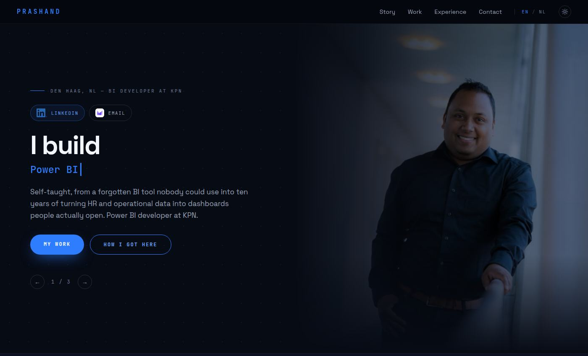
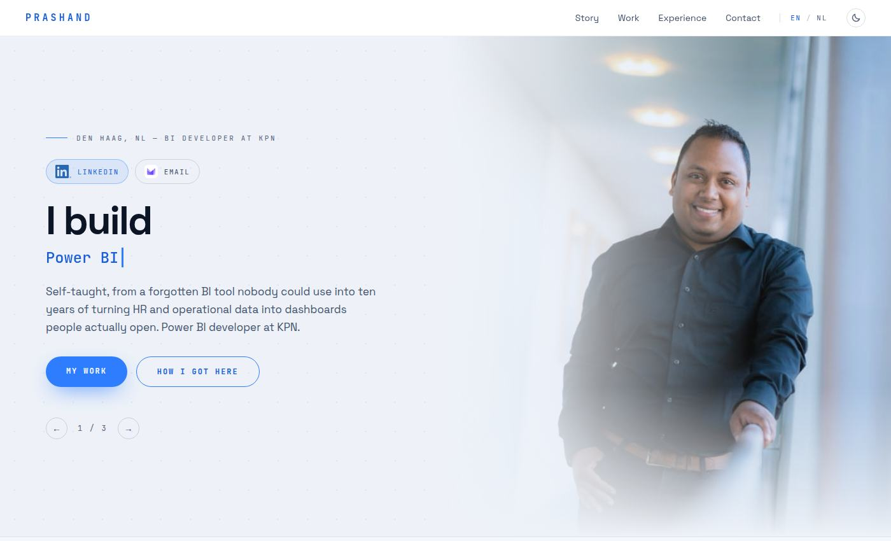

<div align="center">

# prashand.com

**The personal site of Prashand Arthur Banwarie** — Power BI developer and data professional, Den Haag (NL).
Bilingual, static, dark and light, and shipped with no runtime dependencies at all.

[](https://prashand.com)
[](https://github.com/pbanwarie-sketch/super-duper-lamp/deployments)
[](docs/performance.md)
[](docs/security.md)
[](#build)
[](#build)

[**Live site**](https://prashand.com) · [Nederlands](https://prashand.com/nl.html) · [Design system](docs/design-system.md) · [Styleguide](docs/styleguide.html) · [Docs](#documentation)

</div>

<table>
<tr>
<td width="50%"></td>
<td width="50%"></td>
</tr>
<tr>
<td align="center"><sub><b>Dark</b> — the design as exported, and the default</sub></td>
<td align="center"><sub><b>Light</b> — a build-time transform of the same tokens</sub></td>
</tr>
</table>

---

## What this is

A portfolio page built from a design-tool export, but published as something the
design tool would never emit: **plain HTML that paints without JavaScript.** The
export ships each page as a single ~1.6 MB file that carries every font and photo
as base64 and only renders after React plus a 70 KB runtime unpack it in the
browser. A ~1,700-line build script does that unpacking once, at build time, and
writes real files.

Everything below follows from that one decision.

| | |
|---|---|
| **No runtime dependencies** | React, ReactDOM and the design runtime (~276 KB) are replaced by 5 KB of vanilla JavaScript. The build itself has zero npm dependencies. |
| **Bilingual** | English at `/`, Dutch at `/nl.html`, reciprocally `hreflang`-paired. One build, one set of shared assets. |
| **Dark and light** | Every colour literal in the export is rewritten to a CSS custom property. Dark stays the default; light is AA-checked throughout. |
| **Fast** | Lighthouse mobile 99 / 100 / 100 / 100, with photographs recompressed ~90% at build time. |
| **Accessible** | Landmarks, skip link, heading order, focus management on fragment jumps, `prefers-reduced-motion`, a thumb-zone tab bar under 900 px. |
| **Clean scans** | CodeQL on every push: 0 open alerts. |
| **Honest about AI** | The one AI-generated asset is labelled with the European Commission's EU icons. The photographs are real, and the disclosure says so. |

## Live site

| | |
|---|---|
| English | **https://prashand.com** |
| Nederlands | **https://prashand.com/nl.html** |

Served by GitHub Pages from branch `main`, folder `/ (root)` (`CNAME` +
`.nojekyll`).

## Quick start

```sh
git clone https://github.com/pbanwarie-sketch/super-duper-lamp.git
cd super-duper-lamp

node tools/build.mjs            # Node 18+, no dependencies to install

npx --yes http-server . -p 8080 -s   # or: python3 -m http.server 8080
# → http://127.0.0.1:8080
```

The build is deterministic, so `git status` after a build is a reliable diff of
what you actually changed.

## Build

```sh
node tools/build.mjs
```

Reads `src-bundles/*.html` (the design-tool exports) plus the configuration at
the top of `tools/build.mjs`, and writes `index.html`, `nl.html`, `404.html`,
`assets/`, `sitemap.xml` and `robots.txt`.

> [!IMPORTANT]
> **`index.html`, `nl.html`, `404.html` and `assets/` are generated.** Editing
> them by hand works until the next build overwrites them. Humans edit
> `src-bundles/` and `tools/build.mjs` — nothing else.

The build fails rather than emitting a broken page: if a markup transform stops
matching, if a colour literal survives the theme rewrite, or if an image
override's dimensions drift from the export's, you get a stack trace instead of a
silent regression.

## Project structure

```
├── index.html · nl.html · 404.html   generated pages — do not edit
├── assets/                           generated: css, js, fonts, images
│   └── brand/                        committed: third-party marks
├── src-bundles/                      SOURCE — the design-tool exports
├── tools/
│   ├── build.mjs                     SOURCE — the entire build
│   └── img-overrides/                recompressed photographs
├── docs/                             documentation + live styleguide
├── CNAME · robots.txt · sitemap.xml · .nojekyll
```

| Path | Purpose |
|---|---|
| `index.html`, `nl.html` | The two pages. **Generated.** |
| `404.html` | Not-found page, served by Pages for any missing path. **Generated.** |
| `assets/site.css` | Fonts, design CSS, theme tokens, hover rules, responsive and reduced-motion layers |
| `assets/site.js` | Rotating headline, section nav, theme toggle, reveal-on-scroll |
| `assets/fonts/`, `assets/img/` | Self-hosted JetBrains Mono + Space Grotesk subsets, photographs |
| `assets/brand/`, `assets/badges/` | Third-party marks, committed rather than generated — see [Brand assets](docs/brand-assets.md) |
| `assets/eu-ai/` | European Commission icons for labelling AI-generated content |
| `src-bundles/` | The design-tool exports the pages are built from |
| `tools/build.mjs` | The build |
| `tools/img-overrides/` | mozjpeg-recompressed photographs the build ships in place of the export's |

## Making a change

| To change | Edit | Then |
|---|---|---|
| Copy, layout, artwork | re-export from the design tool into `src-bundles/` | [reapply the runtime patches](docs/security.md#after-a-fresh-export) and [regenerate the image overrides](docs/performance.md#photo-overrides) |
| Title, description, social cards | the `PAGES` metadata in `tools/build.mjs` | rebuild |
| The public URL | `SITE` in `tools/build.mjs` | rebuild — canonical, `hreflang`, Open Graph, sitemap, `robots.txt` and the 404 links all follow |
| Colours, light/dark values | the `THEME` table in `tools/build.mjs` | rebuild, then check [`docs/styleguide.html`](docs/styleguide.html) in both themes |
| Breakpoints, motion | `RESPONSIVE_CSS` in `tools/build.mjs` | rebuild |
| Nav, headline, theme behaviour | `SITE_JS` in `tools/build.mjs` | rebuild |
| AI-disclosure wording | each page's `ai` block in `tools/build.mjs` | rebuild |

## Documentation

| Doc | What's in it |
|---|---|
| [**Architecture**](docs/architecture.md) | The build pipeline, what's generated, where to change what |
| [**Design system**](docs/design-system.md) | Principles, tokens, type scale, spacing, components, a11y rules, governance |
| [**Styleguide**](docs/styleguide.html) | The system rendered live, in both themes, reading the real tokens |
| [**Theming**](docs/theming.md) | How light mode is produced as a transform, and what it deliberately doesn't do |
| [**Navigation & accessibility**](docs/navigation.md) | Sticky-nav fixes, the mobile tab bar, focus management, reduced motion |
| [**Performance**](docs/performance.md) | The three build-time measures behind the Lighthouse numbers |
| [**Code scanning**](docs/security.md) | The four CodeQL hardening measures, and one editing hazard |
| [**AI disclosure**](docs/ai-disclosure.md) | What is AI-made, what isn't, and why the labelling is voluntary |
| [**Brand assets**](docs/brand-assets.md) | LinkedIn, Proton and Microsoft marks — sources, terms, sizing rules |

## Deploying

Push to `main`. GitHub Pages rebuilds from the repository root.

<details>
<summary>Enabling Pages from scratch</summary>

1. Repository → **Settings** → **Pages**
2. **Build and deployment** → Source: *Deploy from a branch*
3. Branch **main**, folder **/ (root)** → **Save**
4. Custom domain: `prashand.com` (already in `CNAME`), then tick **Enforce HTTPS**

</details>

Pages caches HTML for 10 minutes, so a push takes a moment to appear. To check
whether a deploy has landed, request a generated asset with a cache-buster —
`/tools/build.mjs?x=1` — rather than reloading the page.

## Contributing

This is a personal site, so there is no roadmap to contribute to — but if you
spot something broken, an issue is very welcome.

If you do open a pull request:

- change `src-bundles/` or `tools/build.mjs`, never the generated files
- run `node tools/build.mjs` and commit the regenerated output alongside the
  source change
- check both themes and all three breakpoints (desktop, ≤900 px, ≤520 px)
- keep the [design system](docs/design-system.md) rules — especially: no colour
  literals, no new radii or easing curves without a reason

## Licence and credits

**Code** (`tools/build.mjs`, the site CSS and JavaScript it emits): MIT — see
[`LICENSE`](LICENSE).

**Content** — the written copy, the photographs, the pixel-art illustration and
the design itself — is © Prashand Banwarie and not covered by that licence.
Please don't reuse it as your own portfolio.

**Third-party assets** keep their own terms: the LinkedIn and Proton Mail marks
and the Microsoft credential badge are used as supplied under each company's
brand guidelines ([details](docs/brand-assets.md)), and the EU AI-labelling icons
are published by the European Commission for free use without attribution
([details](docs/ai-disclosure.md)).

**Typefaces:** [Space Grotesk](https://github.com/floriankarsten/space-grotesk)
and [JetBrains Mono](https://github.com/JetBrains/JetBrainsMono), both under the
SIL Open Font License.

## Contact

**mailprashand@pm.me** · [linkedin.com/in/prashandarthur](https://www.linkedin.com/in/prashandarthur)
